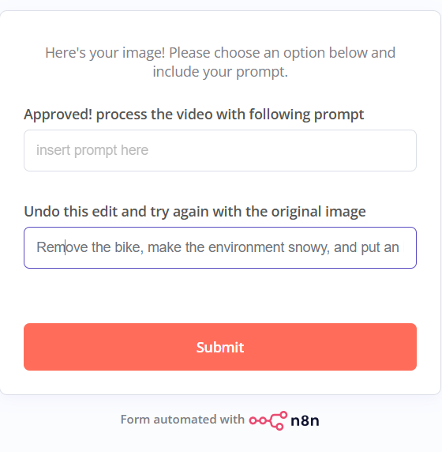
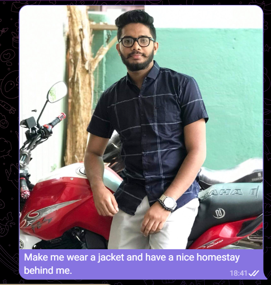
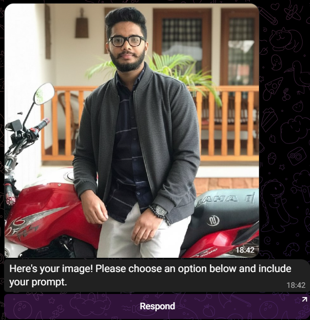
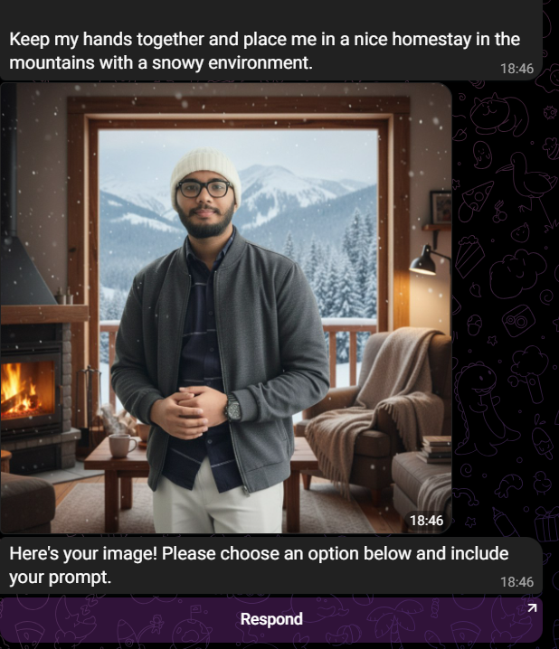

# 🤖 AI-Powered Image & Video Generator with n8n

An end-to-end automated media generation workflow using n8n, combining 
multiple AI tools — from image editing to video generation — all integrated 
through Telegram.

Inspired by **Mayank Aggarwal**, this project taught me how to design 
multi-step AI automation pipelines combining chat interfaces, image 
generation, and video synthesis — all running autonomously!

---

## 🔄 How It Works

| Step | Action |
|------|--------|
| 1️⃣ | User uploads an image + caption via **Telegram Bot** |
| 2️⃣ | **Google Nano Banana API** edits the image based on the caption |
| 3️⃣ | Edited image is hosted via **ImgBB API** and sent back to the user |
| 4️⃣ | User can review and re-edit until satisfied |
| 5️⃣ | User provides a text prompt → **Veo3 via Kie.ai** generates a video |
| 6️⃣ | Final video is delivered back through **Telegram** ✅ |

---

## 🧠 Tech Stack

| Tool | Purpose |
|------|---------|
| n8n | Workflow automation |
| Telegram Bot (BotFather) | User interface |
| Google Nano Banana API | AI image editing |
| ImgBB API | Image hosting |
| Veo3 + Kie.ai | Video generation |

---

## 📸 Screenshots

### Image editing Overview


### Telegram Bot — Image Upload & Edit


### Edited Image Result


### Video Generation Output


---

## 🚀 How to Use This Workflow

1. Import `workflow.json` into your n8n instance
2. Set up your API keys in n8n credentials:
   - Telegram Bot Token (from BotFather)
   - ImgBB API Key
   - Kie.ai API Key
3. Activate the workflow
4. Open Telegram → send an image with a caption → get your result!

---

## 💡 Key Learnings

- Designing multi-step AI automation pipelines
- Combining chat interfaces with image + video generation
- API orchestration with conditional logic in n8n
- Integrating Telegram as a real-time user interface

---

## 📂 Project Structure

\```
ai-image-video-generator-n8n/
├── workflow.json          # Import this into n8n
├── screenshots/           # Demo screenshots
└── README.md
\```
